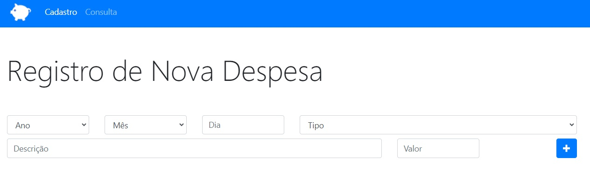
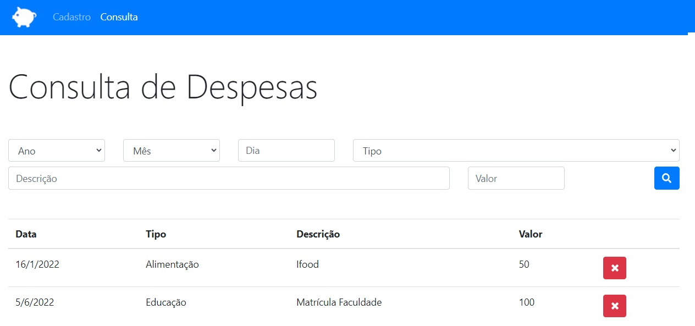

# App Kills Mosquito

Welcome! 

This repository contains a App for personal finance control, using ES6 and Local Storage.

This project was developed during the [Complete Web Development](https://www.udemy.com/course/web-completo/) course (Section ECMAScript and Object Orientation) held at UDEMY.

* Home Page



* Query Page



# 🧠 About

The goal with this project is learn and practice about this functionalities below:

- [x] ECMAScript
- [x] Var and Let
- [x] Const
- [x] Template String
- [x] Arrow function
- [x] Object orientation
- [x] OO - Pillar of Abstraction
- [x] OO - Pillar of Heritage
- [x] OO - Pillar of Encapsulation
- [x] OO - Pillar of Polymorphism
- [x] Literal objects
- [x] Prototype
- [x] Rest/Spread Operator

## 🖥️ Installation

1. Clone this repo
```bash
git clone https://github.com/robernar2011/AppPersonalBudget.git
```
